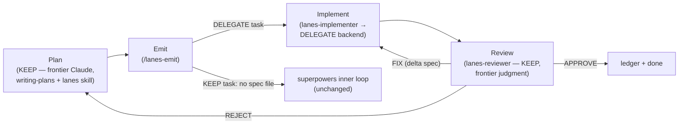

# Lanes

Lanes routes each task to the cheapest model that can do it correctly —
frontier judgment for planning and review, delegated muscle for the rest —
so you burn your frontier quota only where it earns its keep. Concretely:
frontier Claude plans your work, assigns each task a lane, reviews
everything that comes back, and personally handles anything
security-critical; a subscription-priced backend (v1: Codex via the codex
MCP server) grinds through the well-bounded implementation work in
between. The point is frontier-quota preservation — you stop spending your
scarcest, most expensive model tokens on boilerplate and mechanical work
that a cheaper model can do just as correctly under a tight enough
contract.

## Prerequisites

- **[superpowers](https://github.com/obra/superpowers)** installed —
  Lanes is an add-on to it, not a replacement. It hooks superpowers'
  `writing-plans` skill and assumes the superpowers SDD loop
  (brainstorming → writing-plans → executing-plans) is already how you
  work.
- **A DELEGATE backend** configured — v1 ships one working backend, Codex
  via the `codex` MCP server. Without a backend, every task simply stays
  in the KEEP lane (see the honesty note below).
- **Claude Code**, obviously.
- `lanes-reviewer` ships with `model: fable` in its frontmatter — confirm
  that alias resolves to your own frontier model, or override it, before
  your first review.

## Install

```
/plugin marketplace add OniNoKen4192/Lanes
/plugin install lanes@lanes
```

## Set up a project

Run `/lanes-init` once, from the root of the project you want Lanes to
operate on. It inspects your package manifest, verification commands, and
source tree, then drafts `.lanes/config.md` — the one per-project file
every Lanes command and agent reads. It refuses to run below a documented
readiness floor: your project needs a real package manifest, at least one
runnable verification command, and a non-trivial source tree (manifest +
README alone isn't enough) — if you're still at that stage, build the
walking skeleton with superpowers first, then come back.

## Use it

1. **Plan an effort.** Lane assignment happens *inside* superpowers'
   `writing-plans` — the `lanes` skill hooks that step and tags every task
   `(LANE: KEEP)` or `(LANE: DELEGATE, tier <t>)` as the plan is written.
2. **`/lanes-emit <plan>`.** Compiles the approved plan: validates every
   task's lane against the routing rules and emits one spec file per
   DELEGATE-routed task into your project's tasks directory. KEEP tasks
   get no spec file at all.
3. **Dispatch DELEGATE specs to `lanes-implementer`.** It validates the
   spec, hands it to the configured backend verbatim, verifies the result
   itself (scope, acceptance, regression, interfaces — never the backend's
   word alone), and reports DONE / BLOCKED / RATE_LIMITED.
4. **Review with `lanes-reviewer`.** Frontier judgment, one verdict:
   APPROVE, FIX (with a delta spec), or REJECT. Scope violations and
   security-routed touches are automatic rejections, no matter how clean
   the tests look.

KEEP tasks never enter any of this — they run through the ordinary
superpowers inner loop exactly as if Lanes weren't installed.

## The four stages



Plan and Review are always KEEP (frontier judgment). Emit is a compiler,
not a lane itself. Implement is where DELEGATE-routed work actually runs;
KEEP-routed tasks skip Emit/Implement/Review entirely and stay in the
superpowers loop.

## Honesty note

v1 ships **one working backend (Codex/MCP)** behind a documented seam — it
is not a backend framework. Every Codex-specific fact (tool names,
dispatch/reply calls) is isolated to the block marked
`<!-- BEGIN BACKEND SEAM -->` / `<!-- END BACKEND SEAM -->` in
[`agents/lanes-implementer.md`](agents/lanes-implementer.md), plus four
fields in `.lanes/config.md` (`dispatch_tool`, `reply_tool`,
`approval_mode`, `ratelimit_signal`) and that agent's `tools:` frontmatter
line. A second backend is a config change plus a rewrite of that one
block — not a rewrite of the plugin.

## License

MIT — see [LICENSE](LICENSE).
